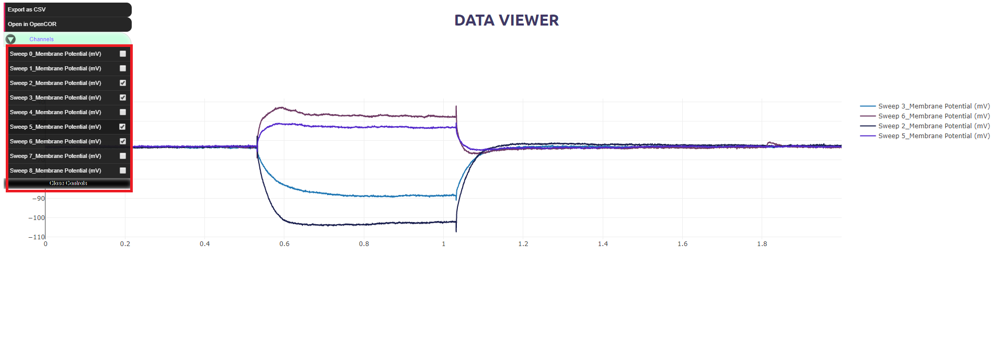
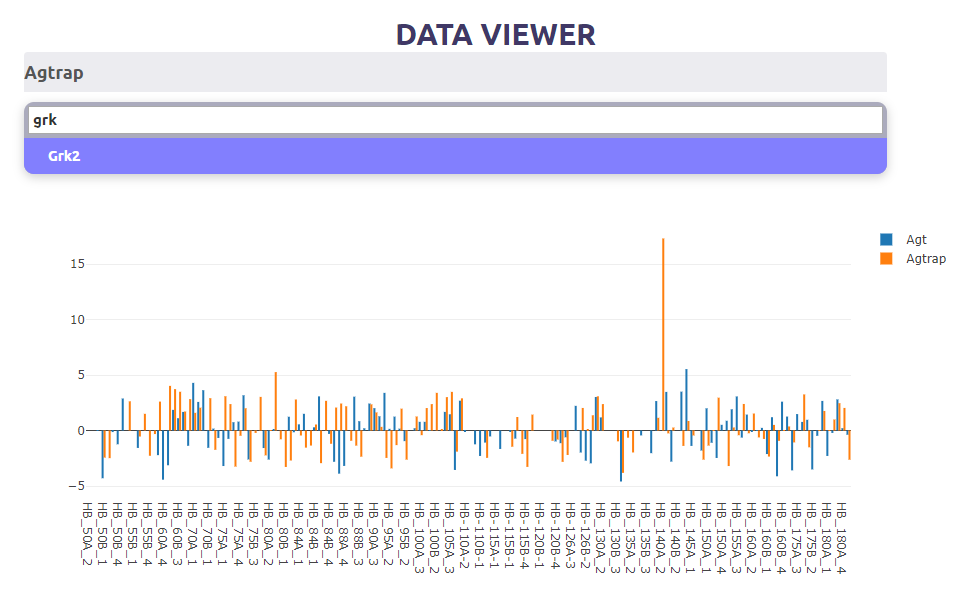
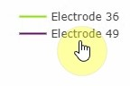
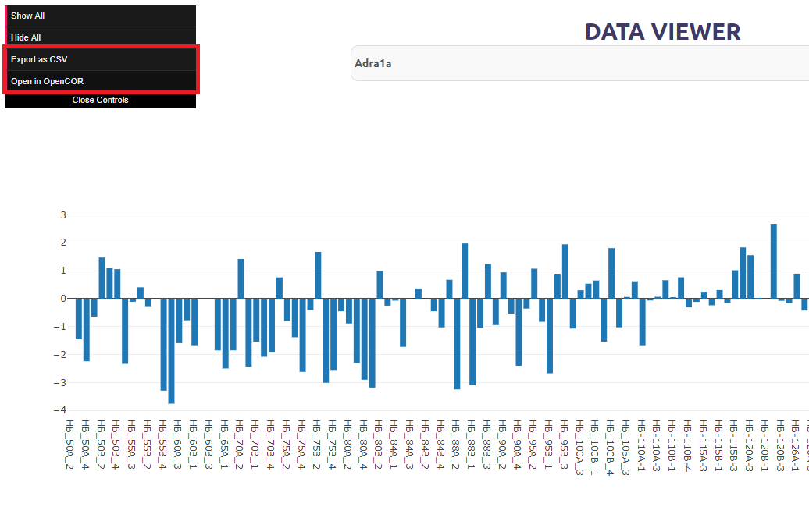
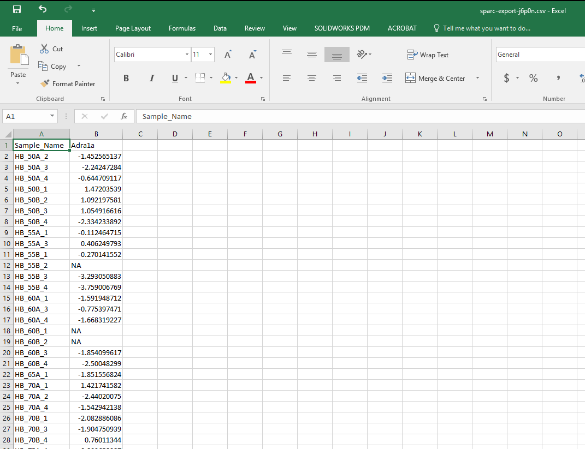

.. _Data-Viewer:

Data Viewer
===========

A module of the data portal designed for viewing and exporting Ephys and Genome data.  

.. contents:: Contents:
   :local:
   :depth: 2
   :backlinks: top

Overview
********

This document describes how to use the data plotting viewer tool available on the SPARC Data Portal. Examples of this tool in action are available at: https://data-viewer-demo.netlify.com/

This module has the ability to: 

    - Plot Ephys CSV datasets on knowledgbase or Blackfynn.
    - Plot Genome and other static CSV datasests.
    - Navigate large datasets via the UI.
    - Add and remove channels from plot and export.
    - Export selected channels as CSV for use in Excel, or OpenCOR

Viewer configuration
********************

The viewer has two modes, for small and large datasests

Small Datasets
--------------

Used for smaller datasets and has more control over exports. (All checked channels will be exported)

Large Datasets
--------------

Used to navigate larger datasets, it has search capability to plot desired channels

Interactive Graphics Controls
*****************************

* Refine the view by draging over a region of interest

.. figure:: _images/plot_refine.jpg
   :figwidth: 95%
   :width: 90%
   :align: center

.. ..

.. figure:: _images/plot_refine_result.jpg
   :figwidth: 95%
   :width: 90%
   :align: center

* Add or remove data by clicking on it's label

The table below describes the effect of different user actions in the flatmap being displayed in this flatmap viewer.

======================= ==============
User action             Result
======================= ==============
Left                    Zoom in via box selection
----------------------- --------------
Middle 				    Zoom in via box selection
----------------------- --------------
Right 					None
----------------------- --------------
Double click			Reset View
======================= ==============

CSV (Comma-Separated Values) Exports
************************************

CSV files for use in Excel, OpenCOR, or your software of choice are available for export. 
The selected data traces plotted will be exported into a version that is either CSV and/or OpenCOR compatible.

Export as CSV
-------------

Data in Excel
-------------

