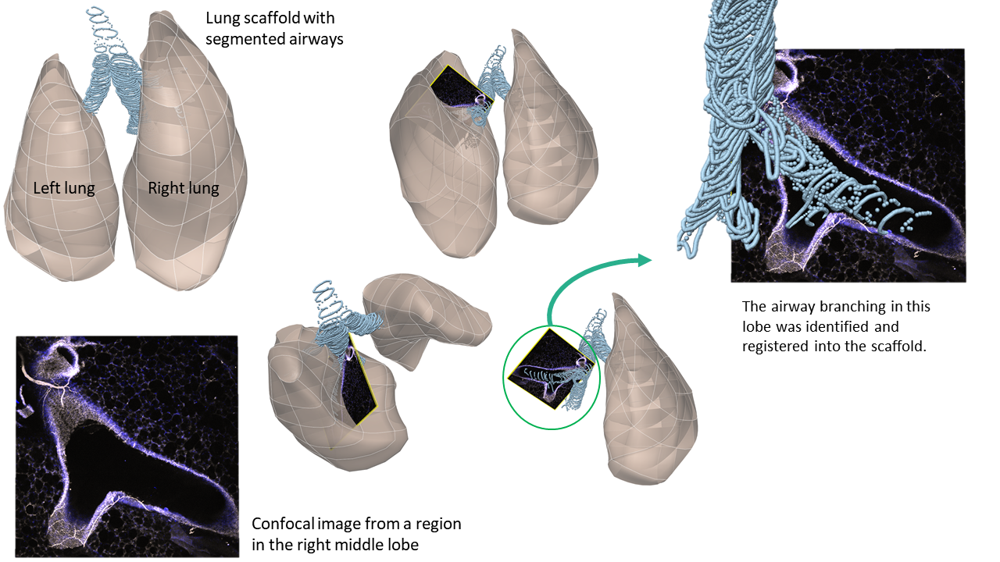
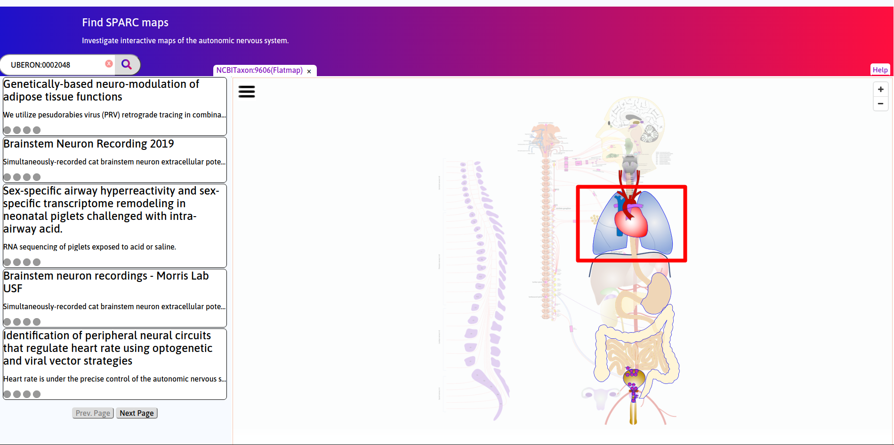
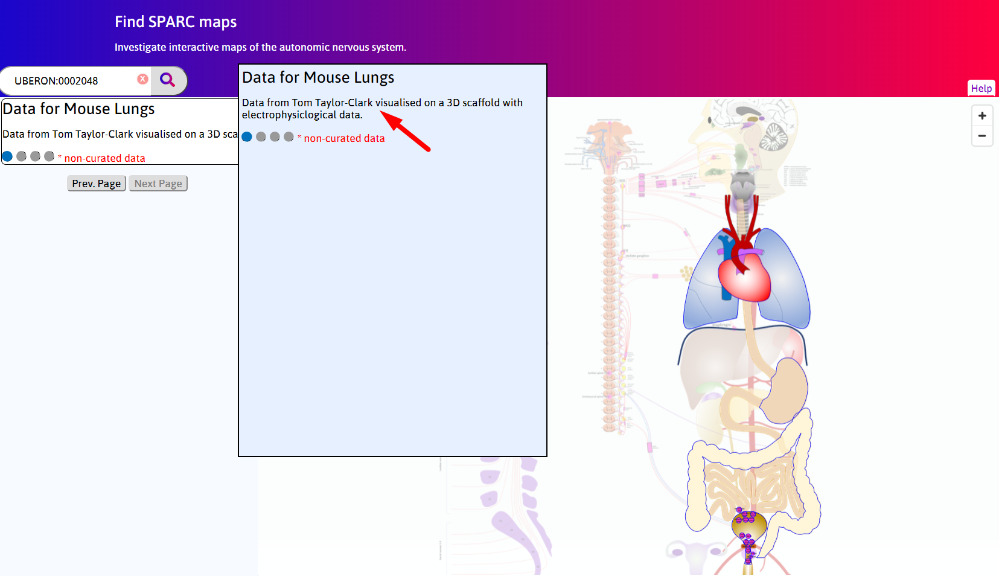
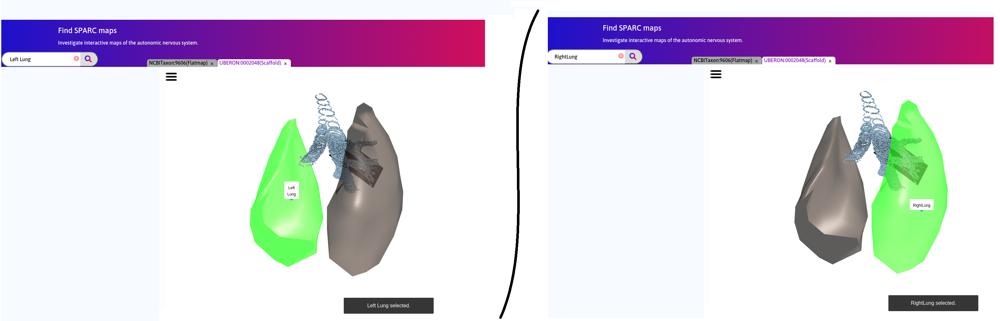
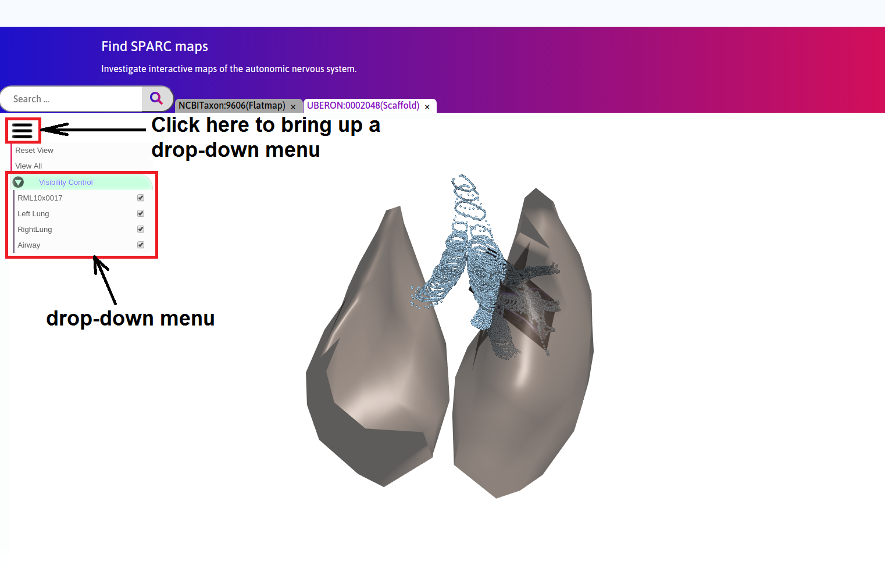
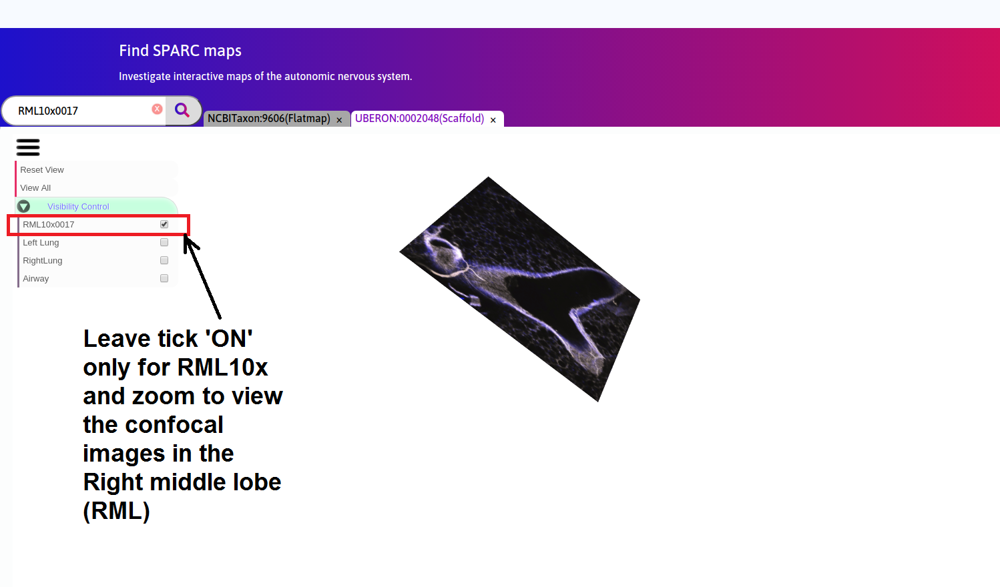

Mapping Gene Expression in the Mouse Lungs from Images to Scaffold
===================================================================		
.. |open-control| image:: /_images/open_control.png
                      :width: 2 em	
					  
.. contents:: Contents: 
   :local:
   :depth: 2
   :backlinks: top
   
Overview
********

A 3D scaffold of the mouse thoracic cavity created using segmentation of longitudinal microCT scans from the SIMBA VIA (Vision and Image Analysis) public database is visualized in the webGL window. The trachea and main bronchi are also shown as rings of segmented points. Confocal stained images from Taylor-Clark group for mouse lungs are embedded into the scaffold. The confocal images were obtained from the right middle lobe (RML). The scaffold was registered to ensure alignment with the airway branch visible on the confocal. This use-case will be the first of many that link the organ systems with the brain stem.

   
.. todo::
	provide demo link 

Step-by-step instructions 
*************************
Follow these step-by-step instructions to familiarise yourself with the flow of the web interface.

**Step 1.** Click on the **Lungs** on the flatmap to generate serach results for lungs.

   
**Step 2.** Select **Data for Mouse Lungs** from the search results. Click on scaffold icon. 

   
**Step 3.** Click on the left and right lungs to highlight them in **green**.

**Step 4.** Click on |open-control| icon to pop-up the drop-down menu.

**Step 5.** Visibility can be turned ON or OFF for the items. 

Working with the interface
**************************
This section explains how to use more specific features of the interface.

.. todo::
      Highlight features/capabilities that are particular to this use-case.
	   
:ref:`Flatmap-Viewer`
^^^^^^^^^^^^^^^^^^^^^
The :ref:`Flatmap-Viewer` represents a high-level view of overall connectivity of the autonomic nervous system.
	
:ref:`Scaffold-Viewer`
^^^^^^^^^^^^^^^^^^^^^^
:ref:`Scaffold-Viewer` is used to view the anatomical organ scaffold of the specific organ selected on the Flatmap.
	
:ref:`Data-Viewer`
^^^^^^^^^^^^^^^^^^
This viewer is used to view the *Electrocardiograph* data recorded with the experiment video. Refer the section :ref:`Data-Viewer`.

