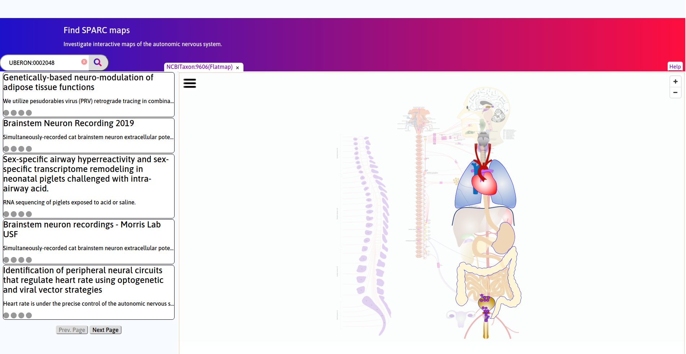
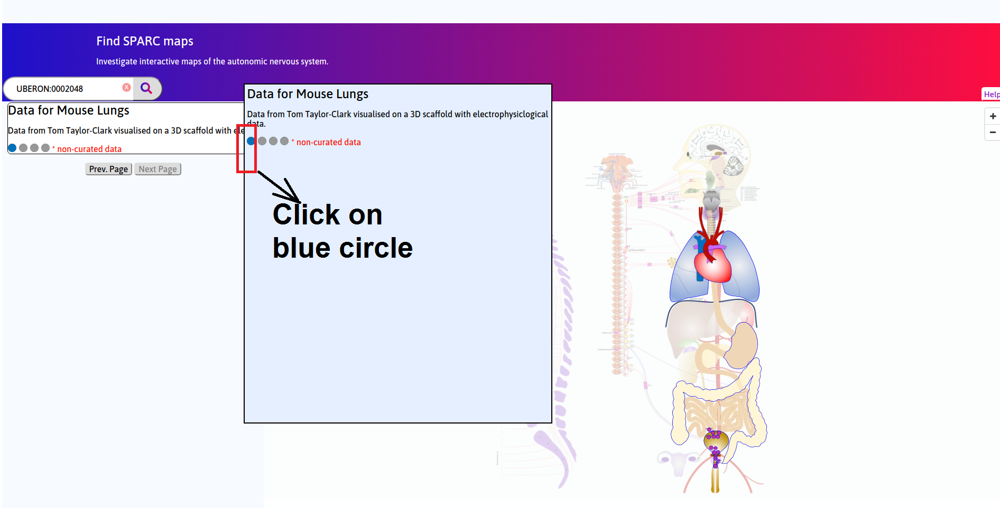

Mouse Brain Stem & Lungs
========================
.. todo::
		Title for this usecase.
			   
.. contents:: Contents: 
   :local:
   :depth: 2
   :backlinks: top
   
Overview
********

A 3D scaffold of the mouse thoracic cavity created using segmentation of longitudinal microCT scans from the SIMBA VIA public database is shown in this window. The trachea and main bronchi are also shown as rings of segmented points. Confocal stained images from Taylor-Clark group for mouse lungs are embedded into the scaffold. The confocal images were obtained from the right middle lobe (RML). The scaffold was registered to ensure alignment with the airway branch visible on the confocal. This use-case will be the first of many that link the organ systems with the brain stem.

.. figure:: _images/use_case5_lung.png
   :figwidth: 100%
   :width: 91%
   :align: center
   
.. todo::
	This document guides a user of the SPARC Data Portal through the steps required to navigate the MAP-core web interface

.. Direct Link::
    https://mapcore-demo.org/current/data-portal/map/#center=0&center=2.842170943040401e-14&dialog=Flatmap&layers=pulmonary&layers=digestive&layers=heart-region&layers=lower-urinary&zoom=4;dialog=Organ%20Viewer&metaURL=https%3A%2F%2Fmapcore-bucket1.s3-us-west-2.amazonaws.com%2FISAN%2Fscaffold%2Flungs%2Flungs_metadata.json&name=Panel0002&part=UBERON%3A0002048&species=Mouse&system=lung

Step-by-step instructions 
*************************
.. todo:: 
		Write steps + screenshots

Follow these step-by-step instructions to familiarise yourself with the flow of the web interface.

**Step 1:** Click on the lungs (Allow a few seconds of time for models to load)

   
**Step 2:** Click on the blue circle under Data for Mouse Lungs

   
**Step 3:** Click on the left and right lungs to highlight them in *green*

.. figure:: _images/SPARC_lungs3.png
   :figwidth: 91%
   :width: 81%
   :align: center

**Step 4:** Click on the three lines to bring up a drop down menu

.. figure:: _images/SPARC_lungs4.png
   :figwidth: 91%
   :width: 81%
   :align: center

**Step 5:** Visibility can be turned ON or OFF for the items. 

.. figure:: _images/SPARC_lungs5.png
   :figwidth: 91%
   :width: 81%
   :align: center

Working with the interface
**************************
This section explains how to use more specific features of the interface.

.. todo::
      Highlight features/capabilities that are particular to this use-case.
	   
:ref:`Flatmap-Viewer`
^^^^^^^^^^^^^^^^^^^^^
The :ref:`Flatmap-Viewer` represents a high-level view of overall connectivity of the autonomic nervous system.
	
:ref:`Scaffold-Viewer`
^^^^^^^^^^^^^^^^^^^^^^
:ref:`Scaffold-Viewer` is used to view the anatomical organ scaffold of the specific organ selected on the Flatmap.
	
:ref:`Data-Viewer`
^^^^^^^^^^^^^^^^^^
This viewer is used to view the *Electrocardiograph* data recorded with the experiment video. Refer the section :ref:`Data-Viewer`.

