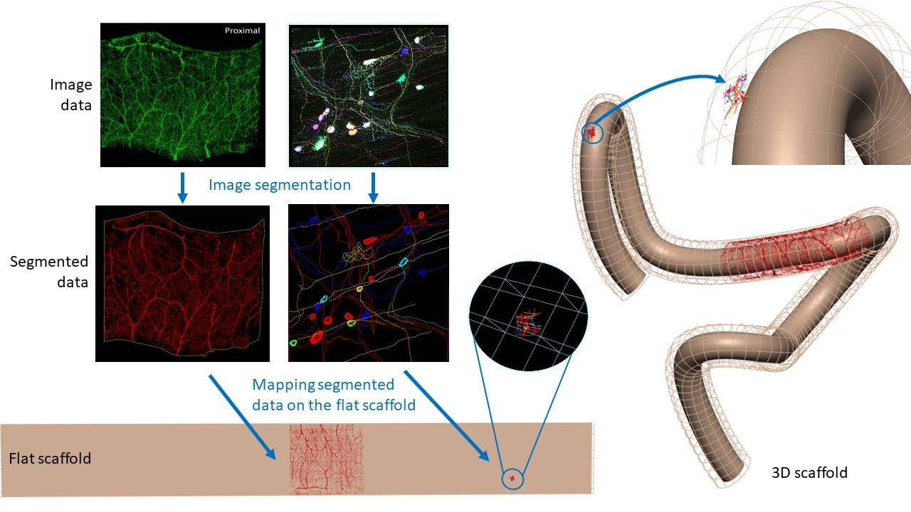
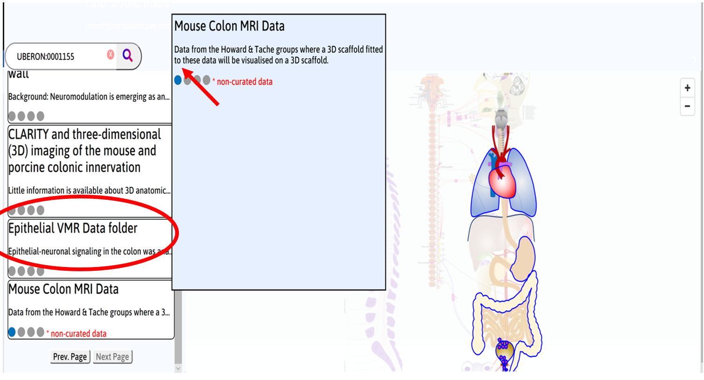
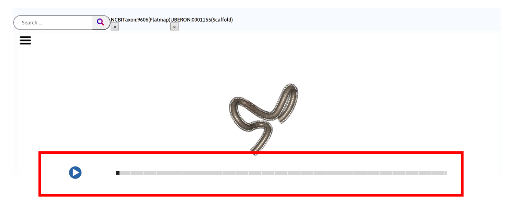
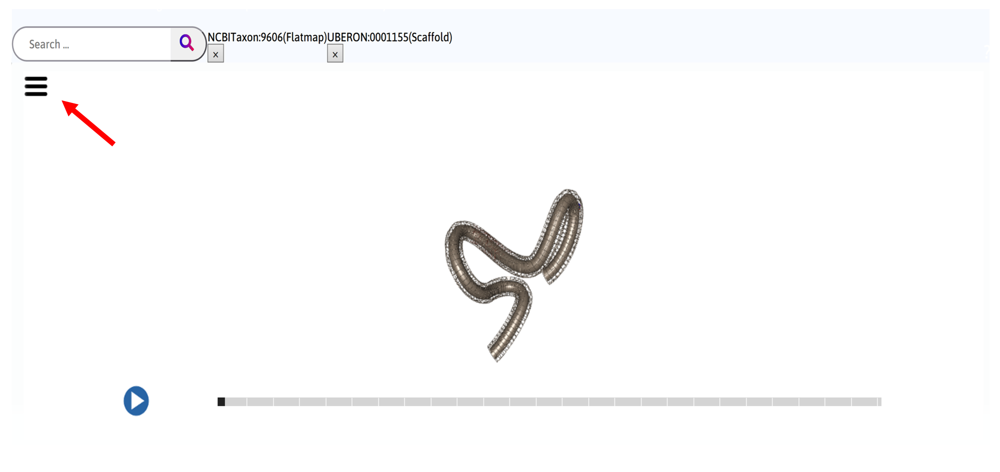
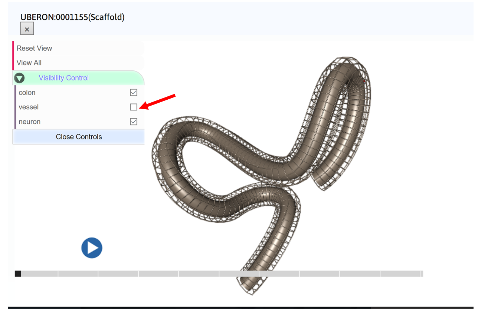
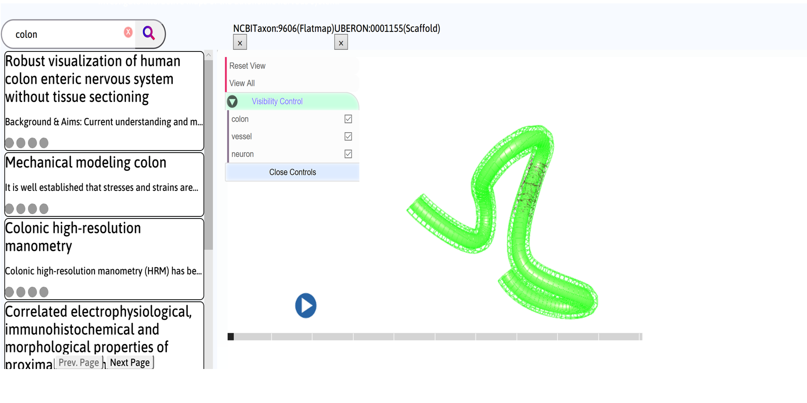
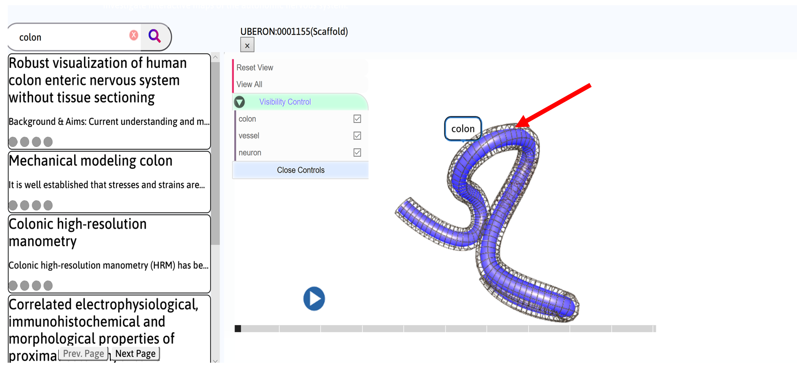

Mapping Image Data in Mouse Colon
=================================
			   
.. contents:: Contents: 
   :local:
   :depth: 2
   :backlinks: top
   
Overview
********

A 3D scaffold fitted to the structural data of mouse colon is visualized in the webGL window. Apart from its 3D configuration, the scaffold is displayed as a flat preparation which represents the state where a colon is stretched out, cut open and laid flat on a surface for imaging purposes.  Segmented image data of enteric neurons and nerve fibers (Tache group) and vasculature (Howard group) of mouse tissue samples are mapped onto the flat scaffold based on the locations where the tissue samples were obtained from.  This allows image and experimental data to be embedded and displayed at labelled material points on the scaffold in both its 3D and flat configuration. The figure below illustrates an overview of the workflow.

.. todo::
    add link to final portal URL that takes user straight to this dataset display.

Step-by-step instructions 
*************************

.. todo::
	insert icon in step 2 and step 4

Follow these step-by-step instructions to familiarise yourself with the flow of the web interface.

**Step 1**. Click on the **Colon** on the flatmap to generate search results for colon. Alternatively, perform a search using keyword *colon* or *UBERON:0001155*.

.. figure:: _images/colon_step1.png
   :figwidth: 95%
   :width: 95%
   :align: center
   
**Step 2**. Select **Mouse Colon Data** from the search results. Click on the scaffold icon (insert icon).

.. todo::

	this screenshot needs to be replaced after Hugh updates the interface to google map style.
	Mabelle comments - I also asked Hugh to change “Mouse Colon MRI data” to “Mouse Colon MRI Data” instead)
	
**Step 3**. Allow a few seconds for the scaffold to load. Navigate between the 3D and flat scaffold using the slider. Click on the **play** button to automate toggle between the two configurations. 

.. todo::
	this screenshot needs to be replaced after Alan updates the view and color.

   
**Step 4**. Control view of the scaffold with *left mouse* click to *rotate* the scaffold, *scroll mouse wheel* for *zoom*, and *right mouse* click to *pan*. Click on the control menu (Insert icon) to expand the controls menu. :guilabel:`Reset View` restores view of the scaffold to the default state. 
    

   
**Step 5**. Uncheck the box next to the group name (for example, vessel) to hide the group from view.  Click on :guilabel:`View All` to return all groups to view within the window. 

   
**Step 6**. Click on the group name under :guilabel:`Visibility Control` (for example, colon) to highlight the group green in the viewing window and to trigger a search request using the group name as a keyword. Click on :guilabel:`Close Controls` to close the expanded controls panel.
   

   
Alternatively, *hover* the mouse over the group (for example, colon) in the viewing window and click on the group when the group name appears to trigger a keyword search.  

   
Working with the interface
**************************
This section explains how to use more specific features of the interface.
	   
:ref:`Flatmap-Viewer`
^^^^^^^^^^^^^^^^^^^^^
The :ref:`Flatmap-Viewer` represents a high-level view of overall connectivity of the autonomic nervous system.
	
:ref:`Scaffold-Viewer`
^^^^^^^^^^^^^^^^^^^^^^
:ref:`Scaffold-Viewer` is used to view the anatomical organ scaffold of the specific organ selected on the Flatmap.
	
:ref:`Data-Viewer`
^^^^^^^^^^^^^^^^^^
This viewer is used to view the *Electrocardiograph* data recorded with the experiment video. Refer the section :ref:`Data-Viewer`.

