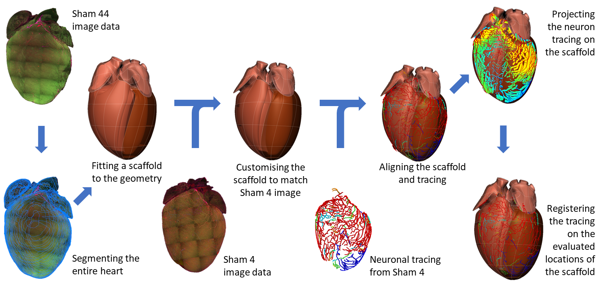

Mapping the Mouse Heart Neurites from Image to Scaffold
========================================================

.. contents:: Contents: 
   :local:
   :depth: 2
   :backlinks: top
   
Overview
********
   
Mouse heart immunohistochemical mapping of neural pathways in cleared heart (sham heart 4) stained with PGP9.5
(glycoprotein surface axonal antibody labelling) from the Shivkumar/Pradeep group is displayed in a 3D mouse heart
scaffold that has been fitted to the segmented heart surface data from Sham Heart 44, which provides a more extensive
geometric dataset. Future experiments are likely to provide much better quality mouse data for both the heart's anatomy
and its embedded neurons. Figure 1 illustrates an overview of the workflow.

.. todo::
	This document guides a user of the SPARC Data Portal through the steps required to .......

.. todo::
    add link to final portal URL that takes user straight to this dataset display.

Step-by-step instructions 
*************************
.. todo:: 
		Write steps + screenshots

Follow these step-by-step instructions to familiarise yourself with the flow of the web interface.

Explain the steps to be followed by the end user on the web interface. 

#. Step 1 ....

Add screenshot

.. .. figure:: _images/snip
   :figwidth: 61%
   :width: 51%
   :align: center
   
#. Step 2 ....

Add screenshot 

Working with the interface
**************************
This section explains how to use more specific features of the interface.

.. todo::
      Highlight features/capabilities that are particular to this use-case.
	   
:ref:`Flatmap-Viewer`
^^^^^^^^^^^^^^^^^^^^^
The :ref:`Flatmap-Viewer` represents a high-level view of overall connectivity of the autonomic nervous system.
	
:ref:`Scaffold-Viewer`
^^^^^^^^^^^^^^^^^^^^^^
:ref:`Scaffold-Viewer` is used to view the anatomical organ scaffold of the specific organ selected on the Flatmap.
	
:ref:`Data-Viewer`
^^^^^^^^^^^^^^^^^^
This viewer is used to view the *Electrocardiograph* data recorded with the experiment video. Refer the section :ref:`Data-Viewer`.

