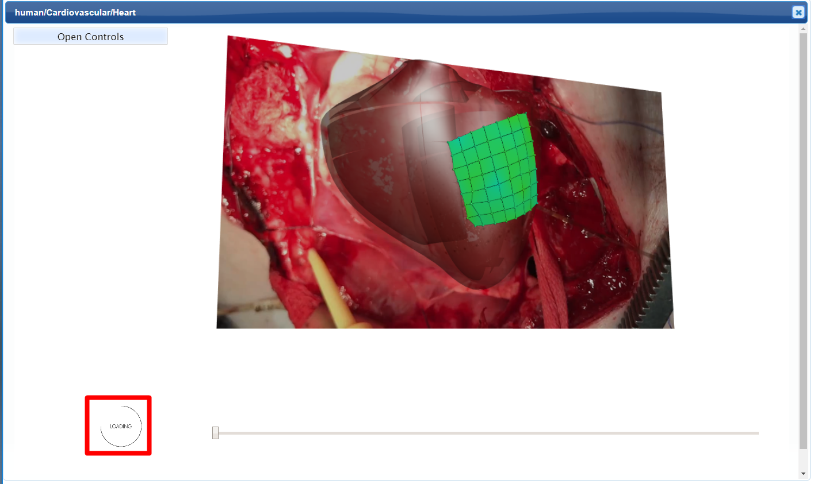
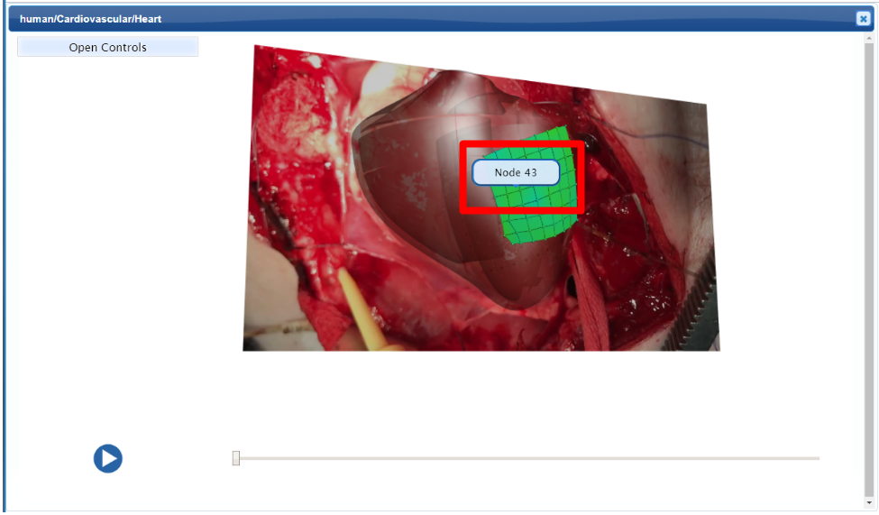
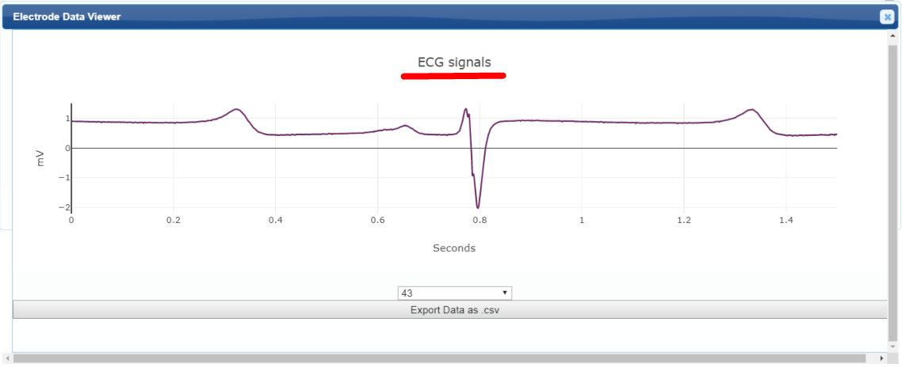
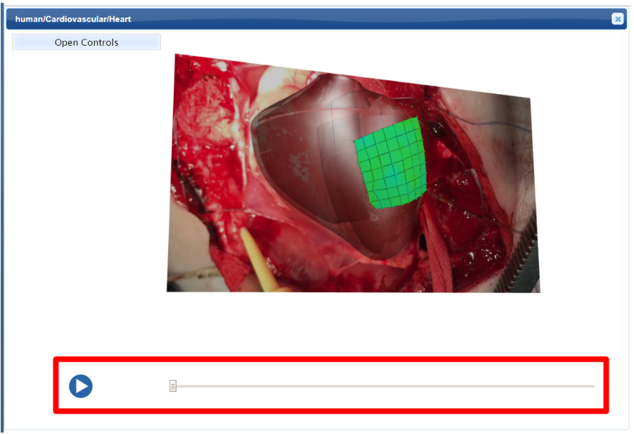

Mapping Cardiac Electromechanics in the Pig
===========================================
			   
.. contents:: Contents: 
   :local:
   :depth: 2
   :backlinks: top
   
Overview
********
	
Pig heart electromechanical data from the Shivkumar/Ardell group is displayed on a 3D pig heart scaffold. The deforming geometry of the pig heart is fitted through the cardiac cycle with the pig heart scaffold. Electrophysiological measurements from two 64-electrode patches, one on the left ventricle (LV) and one on the right ventricle (RV), are fitted as time-varying fields via scaffold parameters and shown on the LV and RV epicardial surfaces, respectively, of the beating heart model. *Note* that these electromechanical data, fitted to the 3D scaffold, are from the same pig heart and include both physiological normal contracting heart beats and the whole heart response to stellate stimulation. This use-case demonstrates the use of the scaffold to merge two types of data set (one mechanical and one electrophysiological) and begins to illustrate the connection between stimulation of the peripheral nervous system and the response at the whole heart level.

This document guides a user of the SPARC Data Portal through the steps required to discover some data looking at autonomic control of the heart.

.. todo::
    add link to final portal URL that takes user straight to this dataset display.

Step-by-step instructions 
*************************

Follow these step-by-step instructions to familiarise yourself with the flow of the web interface.

.. todo:: check these steps and update screen shots

**Step 1:** Allow a few seconds of time for models to load.

   
**Step 2:** Select a *node* to open it's ECG data in a seperate viewer i.e. the Electrode Data Viewer.

   
**Step 3:** Navigate through the video with the play button and slider.

Working with the interface
**************************
This section explains how to use more specific features of the interface.

.. todo::
      Highlight features/capabilities that are particular to this use-case.
	
:ref:`Flatmap-Viewer`
^^^^^^^^^^^^^^^^^^^^^
The :ref:`Flatmap-Viewer` represents a high-level view of overall connectivity of the autonomic nervous system.
	
:ref:`Scaffold-Viewer`
^^^^^^^^^^^^^^^^^^^^^^
:ref:`Scaffold-Viewer` is used to view the anatomical organ scaffold of the specific organ selected on the Flatmap.
	
:ref:`Data-Viewer`
^^^^^^^^^^^^^^^^^^
This viewer is used to view the *Electrocardiograph* data recorded with the experiment video. Refer the section :ref:`Data-Viewer`.
