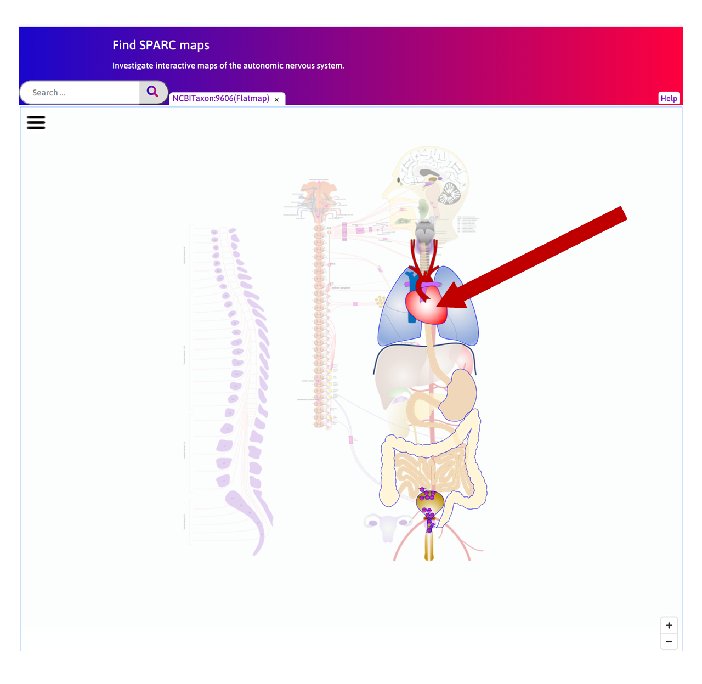
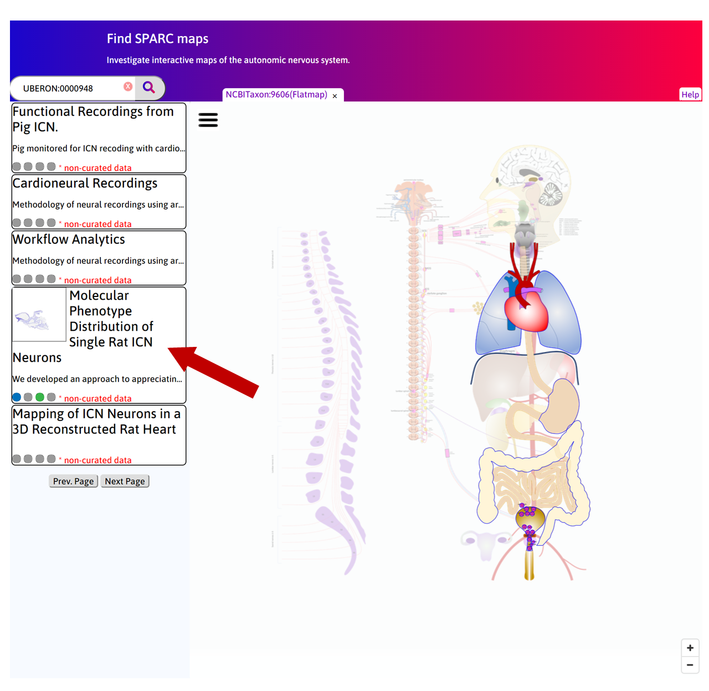
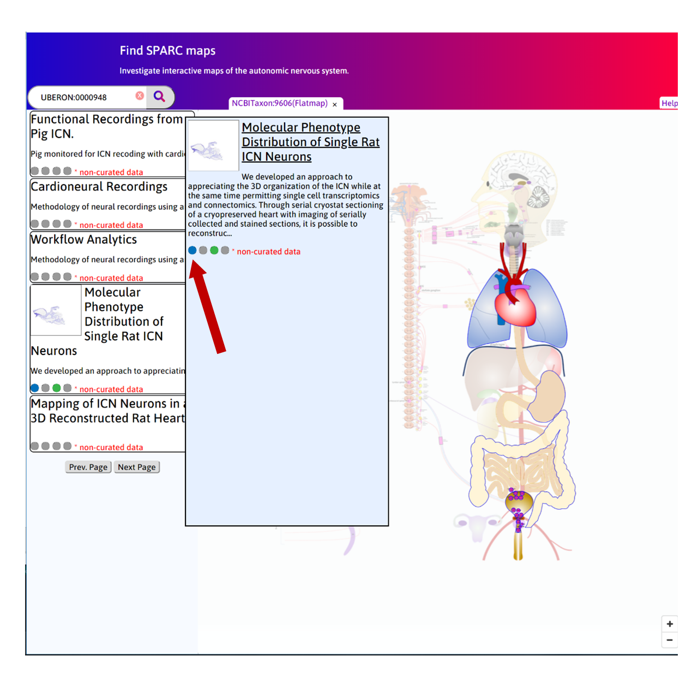
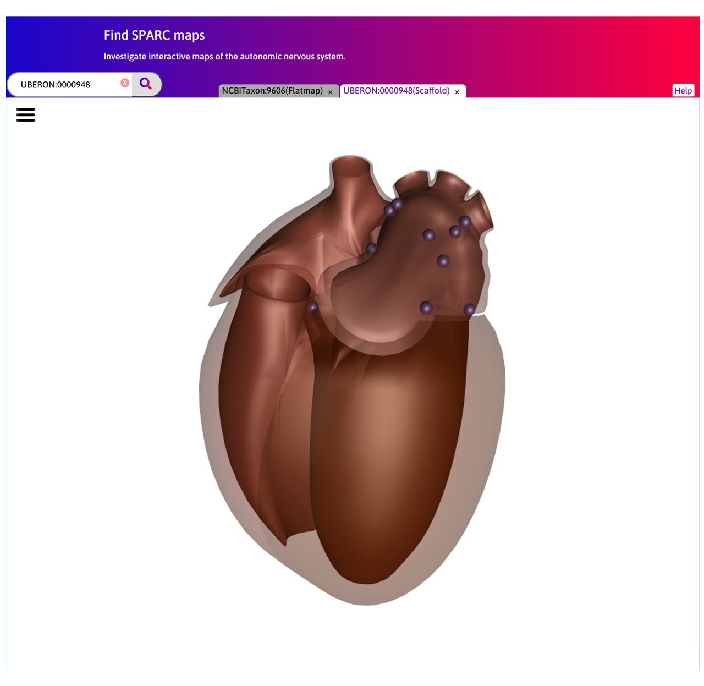
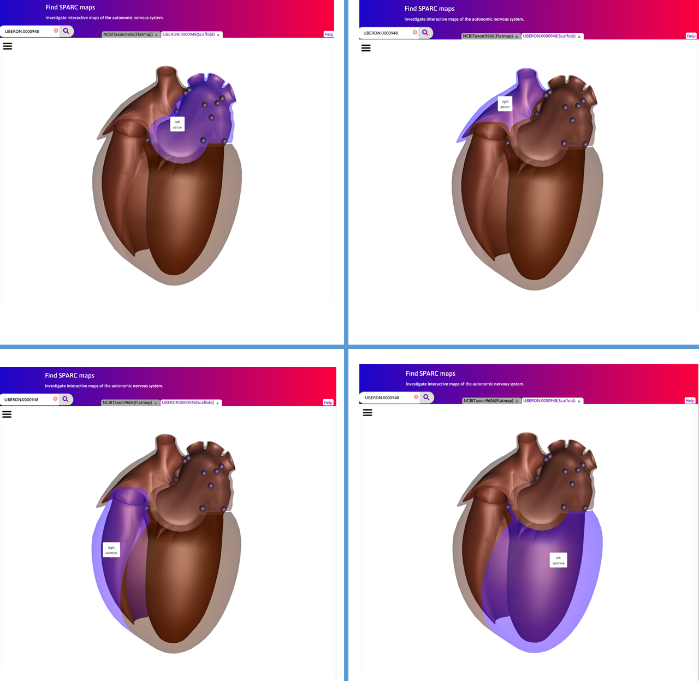
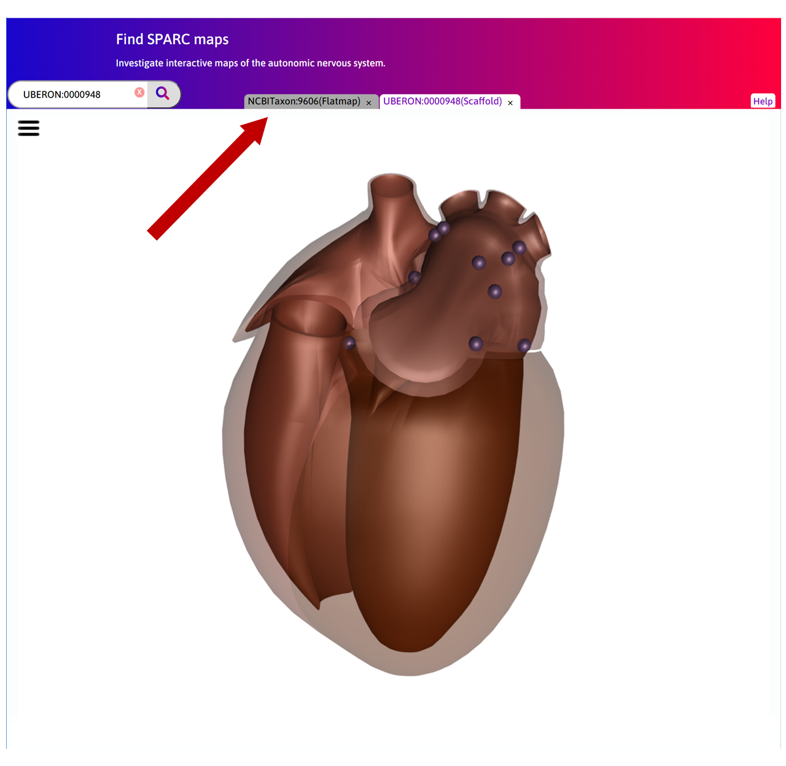
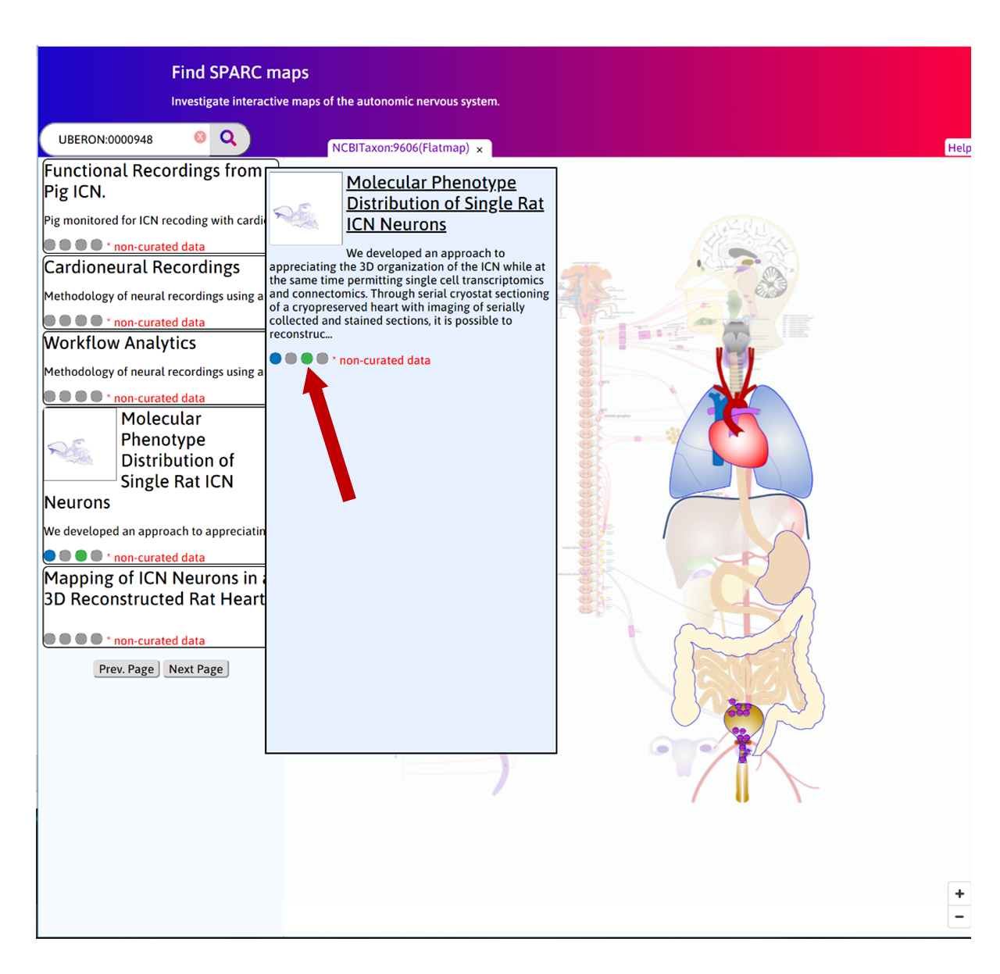
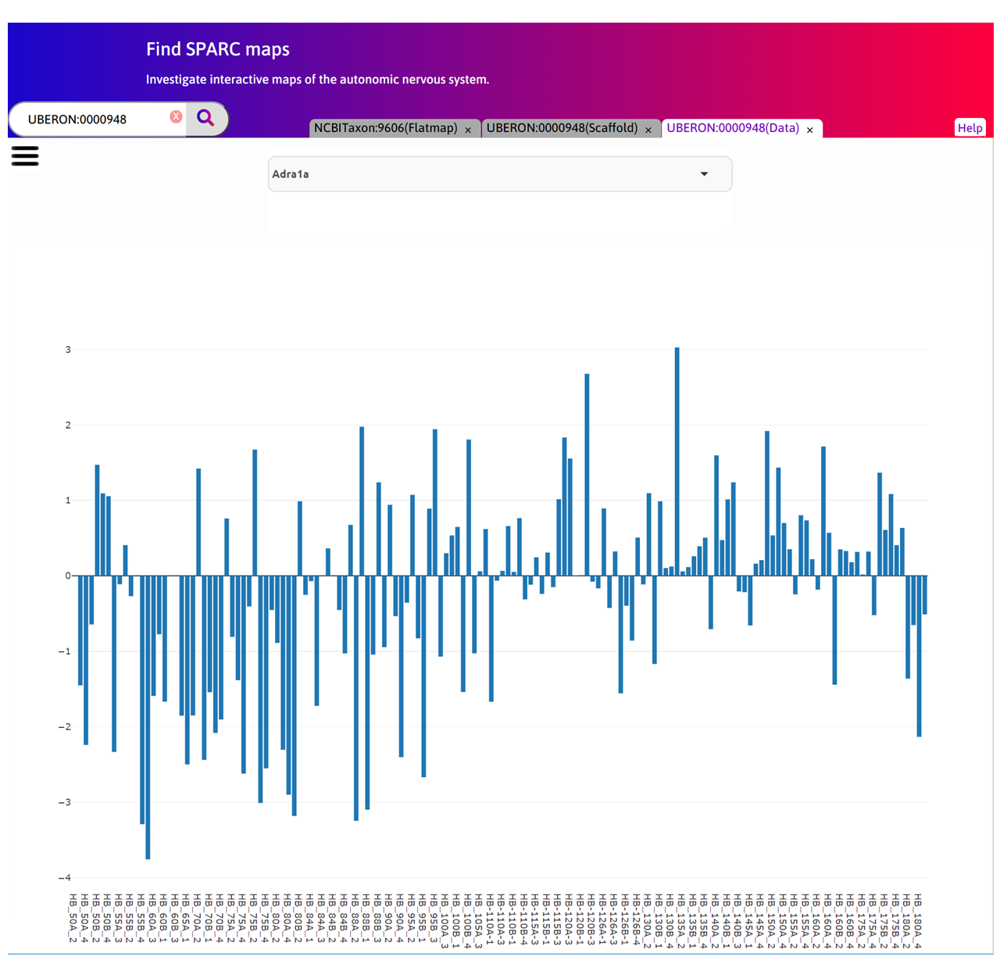
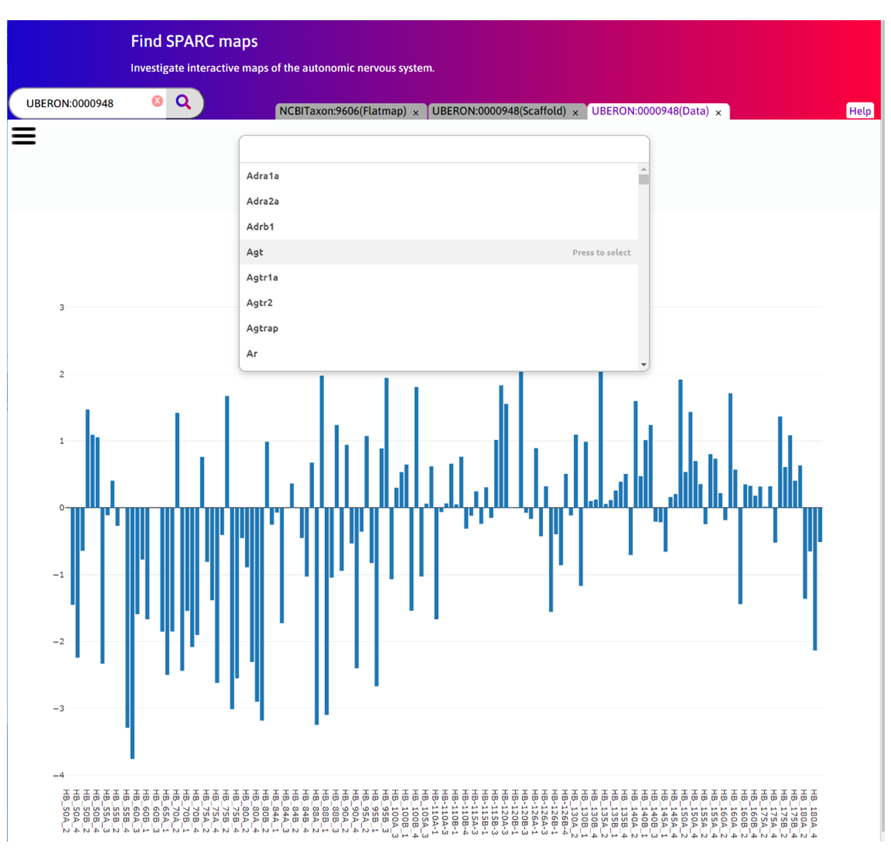
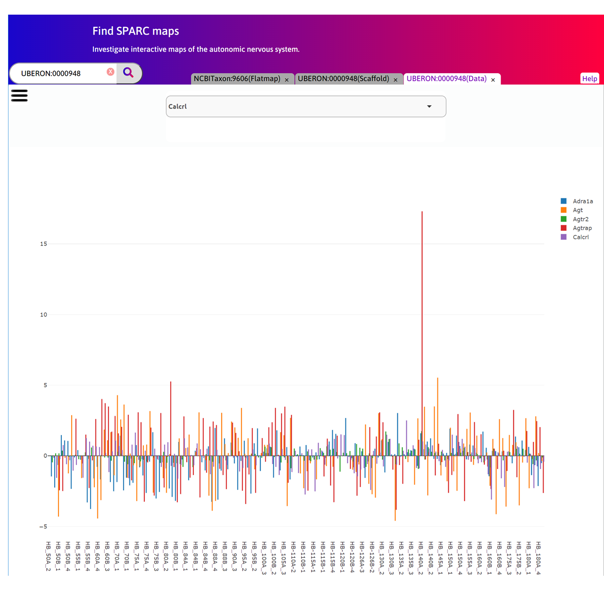

Mapping cellular gene expression in the rat heart: from image to scaffold
=========================================================================
.. contents:: Contents:
   :local:
   :depth: 2
   :backlinks: top
   
Overview
********

Rat heart geometric 3Scan (www.3scan.com) data for both ventricles and both atria from the Schwaber/Vadigepalli/Cheng
group has been fitted with a 3D rat heart scaffold. The locations of a cluster of 151 ICN cell samples that have been
lifted for RNA-Seq analysis (molecular cell body transcript data) from a region of the left atrium, from a different animal,
are indicated on the 3D scaffold. Clicking on one of these tissue locations displays the RNA message level for the 154
genes examined. To visualize the spatial distribution of the RNA message, the 151 samples have been fitted with a
continuous field description using scaffold nodal parameters. Any one of the 154 genes can be selected to show the
spatial variation of that transcript as a heat map. Rat heart neural pathway data showing the efferent connectome
linking ICN cells in the left atrium and the SA node cells on the right atrium will be visualised in the next iteration
of this use-case. Note that the treatment process needed to extract the cells for RNA-Seq analysis left that rat heart
in a very distorted state which was therefore not fitted with a scaffold. Instead corresponding locations of the ICN
cells in the much less distorted 3Scan-processed heart were identified by eye and the cell information was transferred
to that heart.

.. figure:: _images/use_case4_workflow_white.png
   :figwidth: 95%
   :width: 90%
   :align: center

Step-by-step instructions
*************************

Follow these step-by-step instructions to familiarise yourself with the flow of the web interface.

#. Step 1. Click on the Heart on the flatmap to generate search results for heart.

   
#. Step 2. Hover on 'Molecular Phenotype Distribution of Single Rat ICN Neurons' search result.

#. Step 3. Select the blue circle.

#. Step 4. The Scaffold Viewer tab opens and the fitted heart scaffold can be visualised. A number of lifted neuronal cells have been mapped and registered on the scaffold (purple spheres).

#. Step 5. Click on |open-control| icon to pop-up the drop-down menu. Visibility can be turned ON or OFF for each item.

.. figure:: _images/use_case_4/Slide4aa.PNG
   :figwidth: 61%
   :width: 51%
   :align: center

#. Step 6. Hover on different regions to highlight the chambers separately.

#. Step 7. Each cell has been lifted and assayed for the expression of 154 genes selected as associated with
 neuromodulation and cardiac function using qPCR or RNASeq. These have been mapped on the registered cells on the scaffold.
Each cell has a unique ID.

.. figure:: _images/use_case_4/Slide5a.PNG
   :figwidth: 61%
   :width: 51%
   :align: center

#. Step 8. Click on the Flatmap tab again.

#. Step 9. Now click on the green circle in the same search result.

#. Step 10. The Data Viewer tab opens to view the gene expression data. Currently only a raw barplot is supported.
In future, additional visualisation capabilities such as heatmap and clustering will be added.

#. Step 11. From the dropdown menu, more genes can be added to the plot.

#. Step 12. The plot will show the expression of each gene with a unique color for all the registered cells on the scaffold.

