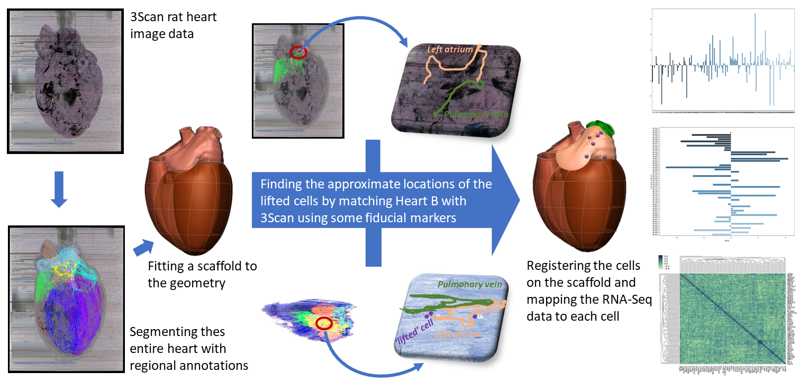

Mapping cellular gene expression in the rat heart: from image to scaffold
=========================================================================
.. contents:: Contents:
   :local:
   :depth: 2
   :backlinks: top
   
Overview
********

Rat heart geometric 3Scan (www.3scan.com) data for both ventricles and both atria from the Schwaber/Vadigepalli/Cheng
group has been fitted with a 3D rat heart scaffold. The locations of a cluster of 151 ICN cell samples that have been
lifted for RNA-Seq analysis (molecular cell body transcript data) from a region of the left atrium, from a different animal,
are indicated on the 3D scaffold. Clicking on one of these tissue locations displays the RNA message level for the 154
genes examined. To visualize the spatial distribution of the RNA message, the 151 samples have been fitted with a
continuous field description using scaffold nodal parameters. Any one of the 154 genes can be selected to show the
spatial variation of that transcript as a heat map. Rat heart neural pathway data showing the efferent connectome
linking ICN cells in the left atrium and the SA node cells on the right atrium will be visualised in the next iteration
of this use-case. Note that the treatment process needed to extract the cells for RNA-Seq analysis left that rat heart
in a very distorted state which was therefore not fitted with a scaffold. Instead corresponding locations of the ICN
cells in the much less distorted 3Scan-processed heart were identified by eye and the cell information was transferred
to that heart.

.. todo::
	This document guides a user of the SPARC Data Portal through the steps required to .......

.. todo::
    add link to final portal URL that takes user straight to this dataset display.

Step-by-step instructions 
*************************
.. todo:: 
		Write steps + screenshots

Follow these step-by-step instructions to familiarise yourself with the flow of the web interface.

Explain the steps to be followed by the end user on the web interface. 

#. Step 1 ....

Add screenshot

.. .. figure:: _images/snip
   :figwidth: 61%
   :width: 51%
   :align: center
   
#. Step 2 ....

Add screenshot 

Working with the interface
**************************
This section explains how to use more specific features of the interface.

.. todo::
      Highlight features/capabilities that are particular to this use-case.
	   
:ref:`Flatmap-Viewer`
^^^^^^^^^^^^^^^^^^^^^
The :ref:`Flatmap-Viewer` represents a high-level view of overall connectivity of the autonomic nervous system.
	
:ref:`Scaffold-Viewer`
^^^^^^^^^^^^^^^^^^^^^^
:ref:`Scaffold-Viewer` is used to view the anatomical organ scaffold of the specific organ selected on the Flatmap.
	
:ref:`Data-Viewer`
^^^^^^^^^^^^^^^^^^
This viewer is used to view the *Electrocardiograph* data recorded with the experiment video. Refer the section :ref:`Data-Viewer`.

