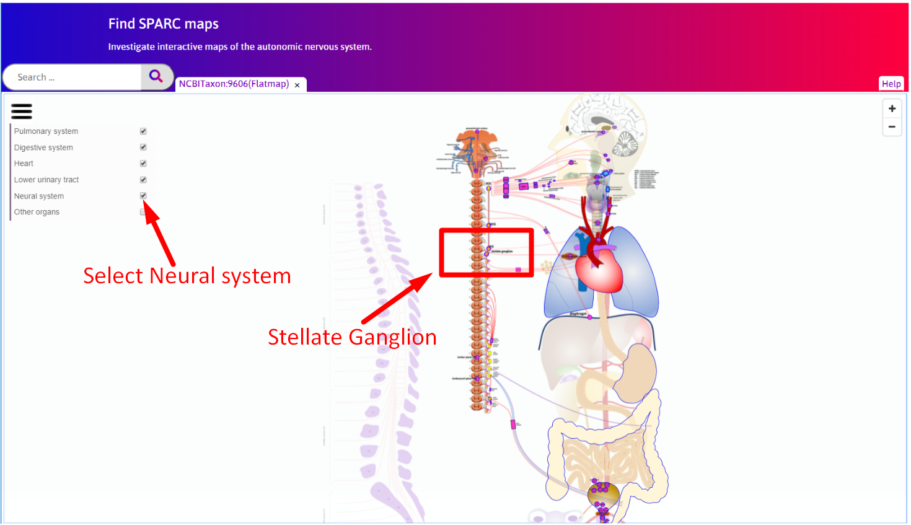

Stellate Ganglion
=================

.. |zoom-in| raw:: html

 
    
.. |zoom-out| raw:: html

 
			   
.. |resize| raw:: html

 
			   
.. |organs| raw:: html

 
				   
.. contents:: Contents: 
   :local:
   :depth: 2
   :backlinks: top
   
Overview
********
   
This document describes how to use the 'Stellate Ganglion' visualization. The demonstration for this module is available at https://mapcore-demo.org/current/data-portal/map/. 

Step-by-step instructions 
*************************

Follow these step-by-step instructions to familiarise yourself with the flow of the web interface.

**Step 1**. Click on the **Stellate Ganglion** on the Flatmaps window. 

   
**Step 2**. A new window will pop-up i.e. Organs Viewer which displays the anatomical organ scaffold of the stellate. 

.. figure:: _images/sg_snip2.png
   :figwidth: 80%
   :width: 95%
   :align: center

**Step 3**. Click on a particular sample data point to exhibit an electrode array recording electrical data on the new Chart/Blackfynn Exporter window.

.. figure:: _images/sg_snip4.png                                                                    
   :figwidth: 80%
   :width: 95%
   :align: center
   
.. figure:: _images/sg_snip5.png
   :figwidth: 80%
   :width: 95%
   :align: center

How to work with this interface?
********************************

This section explains how to work with different panes within this interface.

Flatmaps Pane
^^^^^^^^^^^^^

The flatmaps represents a high-level view of overall connectivity of the autonomic nervous system. This pane provides the below functionalities:

1. |organs| icon provides an option to display or hide a selected organs systems.

2. |zoom-in| icon lets you zoom-in  and |zoom-out| icon zoom-out the flatmap.

3. |resize| icon to resize this flatmap pane.

Organs Viewer Pane
^^^^^^^^^^^^^^^^^^

Organs Viewer is used to view the anatomical organ scaffold of the specific organ selected on the Flatmaps. 

	
	* The :guilabel:`Open Controls` button at the top-left corner of this demonstration elaborates different controls which help to edit the visualisation and configuration of the stellate.
	
			* :guilabel:`Background` control provides an option to change the background color. 
	
			* :guilabel:`Reset View` control restore the organ scaffold to the default state.
			
			* :guilabel:`View All` control ensures the entire organ scaffold is visible.
			
			* :guilabel:`Visibilty Control` displays various sample data points on the Stellate. Clicking or hovering over the different data points shows the selected sample data point; unchecking the data point will cause the data point to be hidden in the current scaffold visualisation of the Stellate. 
		
			
	* The :guilabel:`Close Controls` button closes the expanded controls panel.
	
.. note::

   The organ scaffold visualisation can be manipulated by different :doc:`InteractiveGraphicsControls`. 
	
Chart Pane
^^^^^^^^^^

This pane exhibit an electrode array recording electrical data.

