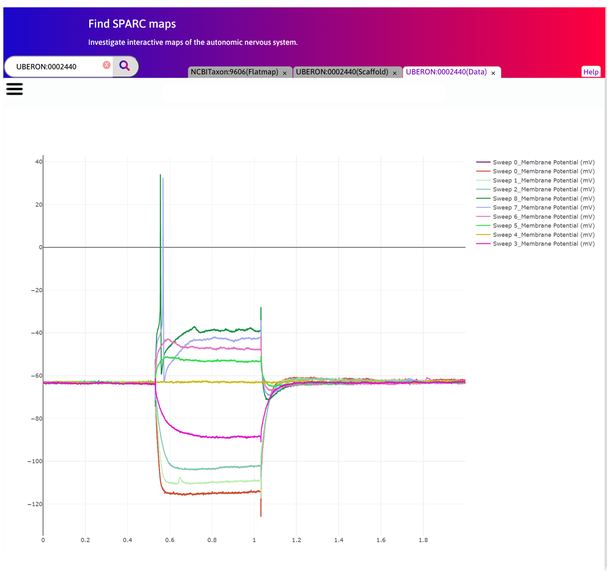
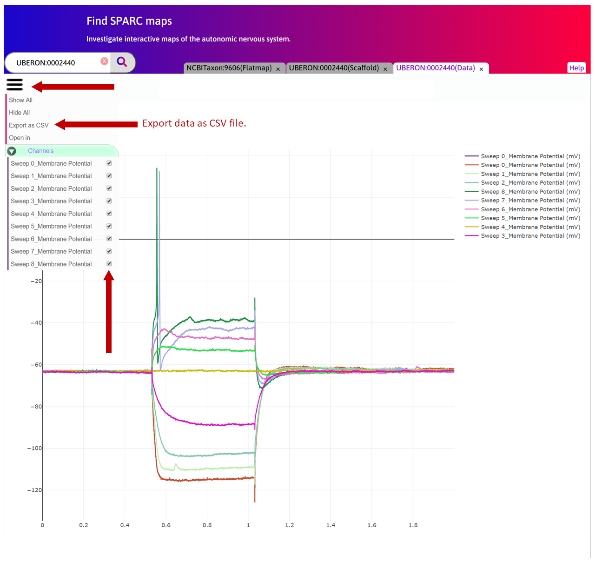

Cell Body Segmentation and Electrophysiology Data: Stellate Ganglion
====================================================================

.. |open-control| image:: /_images/open_control.png
                      :width: 2 em			
		
.. contents:: Contents: 
   :local:
   :depth: 2
   :backlinks: top
   
Overview
********

Mouse stellate ganglion neuronal cell shape data from the Shivkumar/Tompkins group are displayed in a 3D stellate scaffold. 15 neurons, including their cell bodies, axons and dendrites, are displayed on five cross-sections of the stellate with the high resolution image displayed as a texture map. Electrophysiological data from these cells can be visualized by clicking on the cell. *Note* that the scaffold in this example is a geometrically simple shape designed to register the images in the appropriate anatomical location. The shape of the scaffold will be improved once more data are available to define the stellate boundaries.

This document guides a user of the SPARC Data Portal through the steps required to discover a collection of segmented cell bodies from the stellate ganglion which have been mapped to a common coordinate framework for visualization purposes. The user is able to discover any electrophysiology data that has been recorded for each of the cell bodies.

.. todo::
    add link to final portal URL that takes user straight to this dataset display.

Step-by-step instructions 
*************************

Follow these step-by-step instructions to familiarise yourself with the flow of the web interface.

**Step 1**. Click on the **Stellate Ganglion** on the Flatmap tab.

.. figure:: _images/sg_snip11.png
   :figwidth: 55%
   :width: 90%
   :align: center
   
**Step 2**. A new tab called Organ Viewer will open to display the anatomical organ scaffold of the stellate. The current
scaffold is a rectangular cube with slots to contain the stellate image stacks using texture mapping techniques within
the scaffold elements. Segmented cells (Soma) with associated axon and dendrites have been mapped and embedded in
the image-scaffold structure. Each cell will have electro-physiological data properly registered.

.. figure:: _images/stellate_scaffold_image_01.png
   :figwidth: 80%
   :width: 95%
   :align: center

**Step 3**. Click on a cell in a sample to visualise the electro-physiological data associated with the cell.

.. figure:: _images/stellate_scaffold_image_02.png
   :figwidth: 80%
   :width: 95%
   :align: center

**Step 4**. The data is illustrated within a new tab called Data Viewer.

**Step 4**. Click on |open-control| to open the control panel. You can select different sweep or channel data for that cell in this tab to visualise at the same time.
You can also export the data as a CSV format file.

